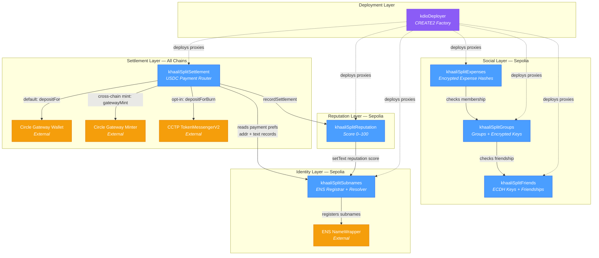

# khaaliSplit — Contract Architecture Overview

> High-level view of all contracts, their roles, and how they connect.

## System Architecture

## Contract Summary

| Contract | Chain(s) | Role | Upgradeable |
|----------|----------|------|:-----------:|
| **kdioDeployer** | All | CREATE2 factory — deploys ERC1967Proxy instances at deterministic addresses | No (stateless) |
| **khaaliSplitFriends** | Sepolia | ECDH public key registry + bidirectional friend graph | UUPS |
| **khaaliSplitGroups** | Sepolia | Group creation + invite/accept with encrypted AES group keys | UUPS |
| **khaaliSplitExpenses** | Sepolia | Expense hash storage + encrypted data emission via events | UUPS |
| **khaaliSplitSubnames** | Sepolia | ENS `{user}.khaalisplit.eth` registrar + on-chain text/addr resolver | UUPS |
| **khaaliSplitReputation** | Sepolia | Per-user reputation score (0–100), auto-synced to ENS text records | UUPS |
| **khaaliSplitSettlement** | All | USDC payment router — EIP-3009 auth + Gateway/CCTP routing | UUPS |

## Key Design Patterns

- **All contracts are UUPS upgradeable** — `Initializable` + `UUPSUpgradeable` + `OwnableUpgradeable`
- **CREATE2 deterministic deployment** — same proxy addresses across chains (Settlement)
- **ENS as identity backbone** — subname nodes are the canonical user identifier
- **Client-side encryption** — contracts store only hashes; encrypted blobs in events
- **USDC only** — single approved token across all chains
