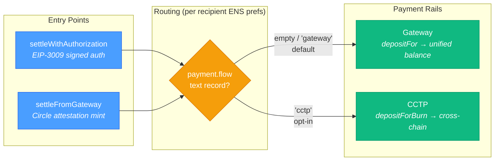
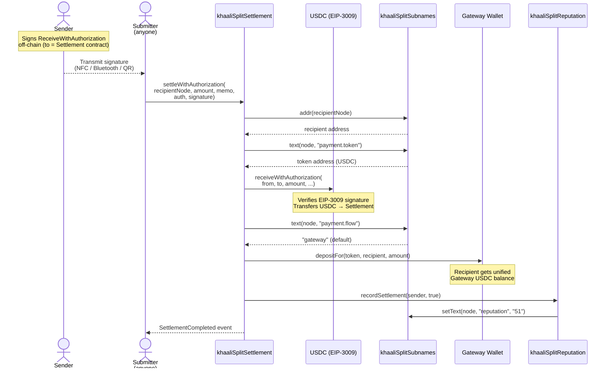
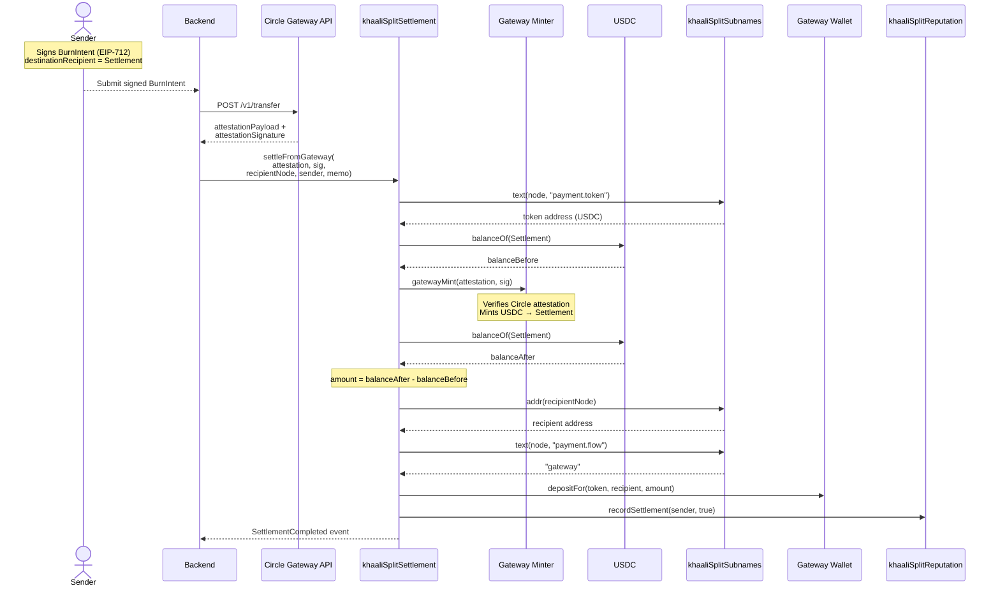
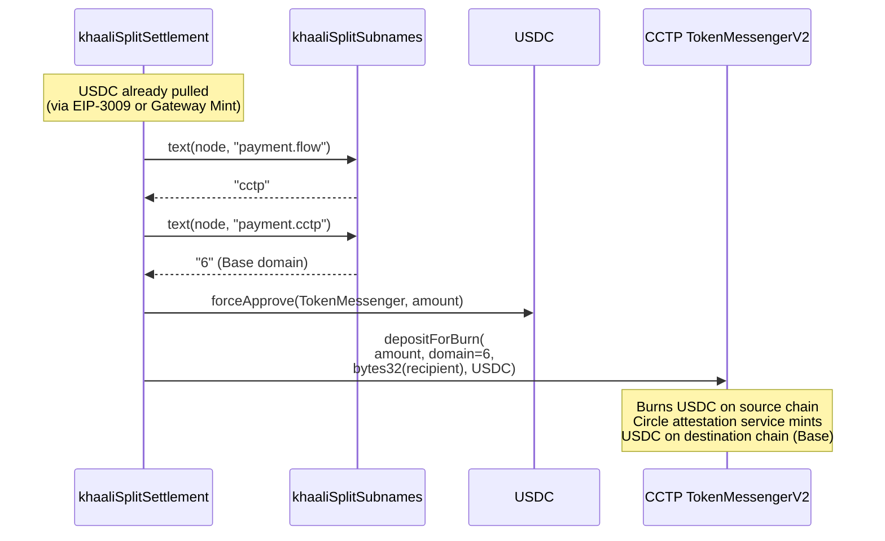

# khaaliSplit — Settlement Flows

> How USDC payments are routed from sender to recipient across chains.

## Overview

khaaliSplit supports two settlement entry points, each routing through one of two payment rails based on the recipient's ENS text record preferences.

---

## Flow 1: Direct Settlement (EIP-3009)

The primary flow for peer-to-peer payments. The sender signs a `ReceiveWithAuthorization` message off-chain; anyone can submit it on-chain (enables NFC, Bluetooth, QR, or relayed payments).

---

## Flow 2: Gateway Mint Settlement (Cross-Chain)

For cross-chain payments from a Gateway balance. The sender signs a BurnIntent (EIP-712) off-chain; the backend obtains a Circle attestation and calls the contract.

---

## Flow 3: CCTP Routing (Opt-In Cross-Chain Burn)

When a recipient opts into CCTP by setting `payment.flow = "cctp"` and `payment.cctp = "<domain>"` in their ENS text records. Works with either entry point.

---

## ENS Text Record Payment Preferences

Recipients configure their payment routing via ENS text records on their `{user}.khaalisplit.eth` subname:

| Text Record Key | Example Value | Description |
|-----------------|---------------|-------------|
| `com.khaalisplit.payment.token` | `0x833589fC...` | USDC address on destination chain |
| `com.khaalisplit.payment.chain` | `8453` | Destination chain ID |
| `com.khaalisplit.payment.flow` | `gateway` / `cctp` | Routing preference (default: gateway) |
| `com.khaalisplit.payment.cctp` | `6` | CCTP domain (required if flow = cctp) |

## Supported Chains

| Chain | Chain ID | CCTP Domain | Gateway | CCTP |
|-------|----------|:-----------:|:-------:|:----:|
| Sepolia | 11155111 | 0 | Yes | Yes |
| Base Sepolia | 84532 | 6 | Yes | Yes |
| Arc Testnet | 1397 | N/A | Yes | No |
| Ethereum | 1 | 0 | Yes | Yes |
| Base | 8453 | 6 | Yes | Yes |
