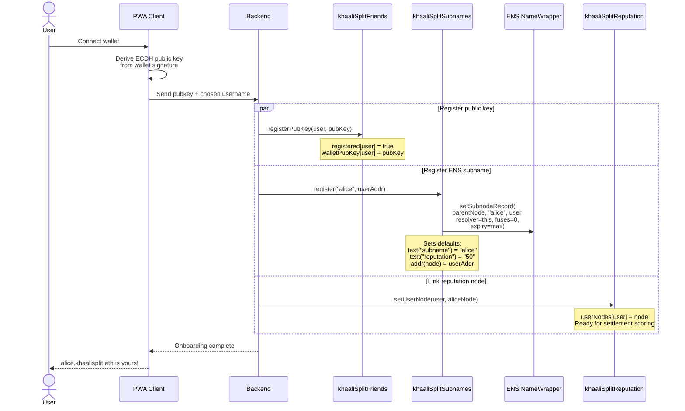
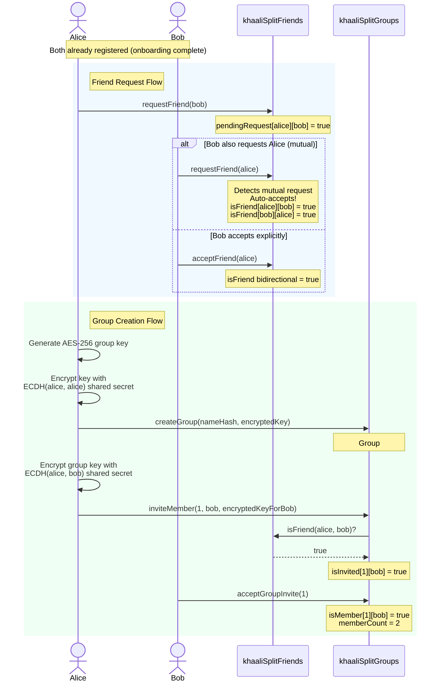
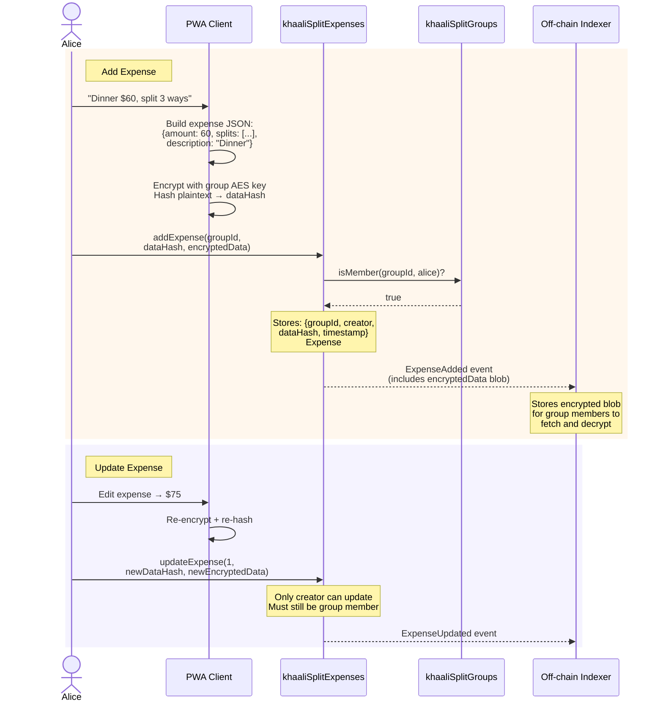
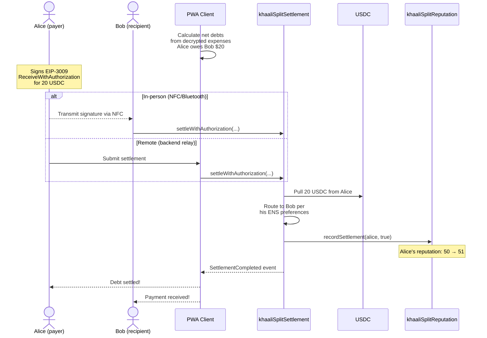
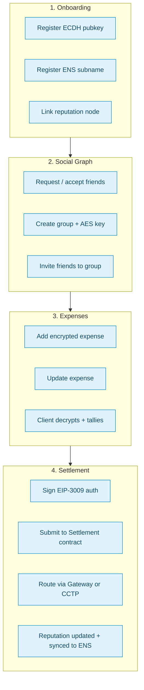

# khaaliSplit — User Journey Flows

> End-to-end flows from a user's perspective: onboarding, social graph, expense tracking, and settlement.

## Complete User Journey
> 

>
>  
see rendered image

>
>  
>
> 

---

## 1. Onboarding Flow

A new user registers their wallet, gets an ENS subname, and is linked into the reputation system.
> 

>
>  
see rendered image

>
>  
>
> 

---

## 2. Social Graph Flow

Users build their friend graph and form expense-splitting groups.
> 

>
>  
see rendered image

>
>  
>
> 

---

## 3. Expense Tracking Flow

Group members add and update encrypted expenses. Only hashes are stored on-chain; full encrypted data is emitted in events for off-chain indexing.
> 

>
>  
see rendered image

>
>  
>
> 

---

## 4. Settlement Flow (Simplified User Perspective)

After expenses are tallied client-side, the payer settles their debt in USDC.
> 

>
>  
see rendered image

>
>  
>
> 

---

## End-to-End Summary
> 

>
>  
see rendered image

>
>  
>
> 

