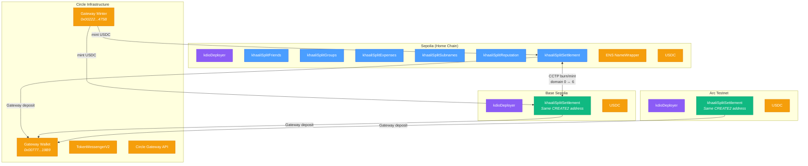
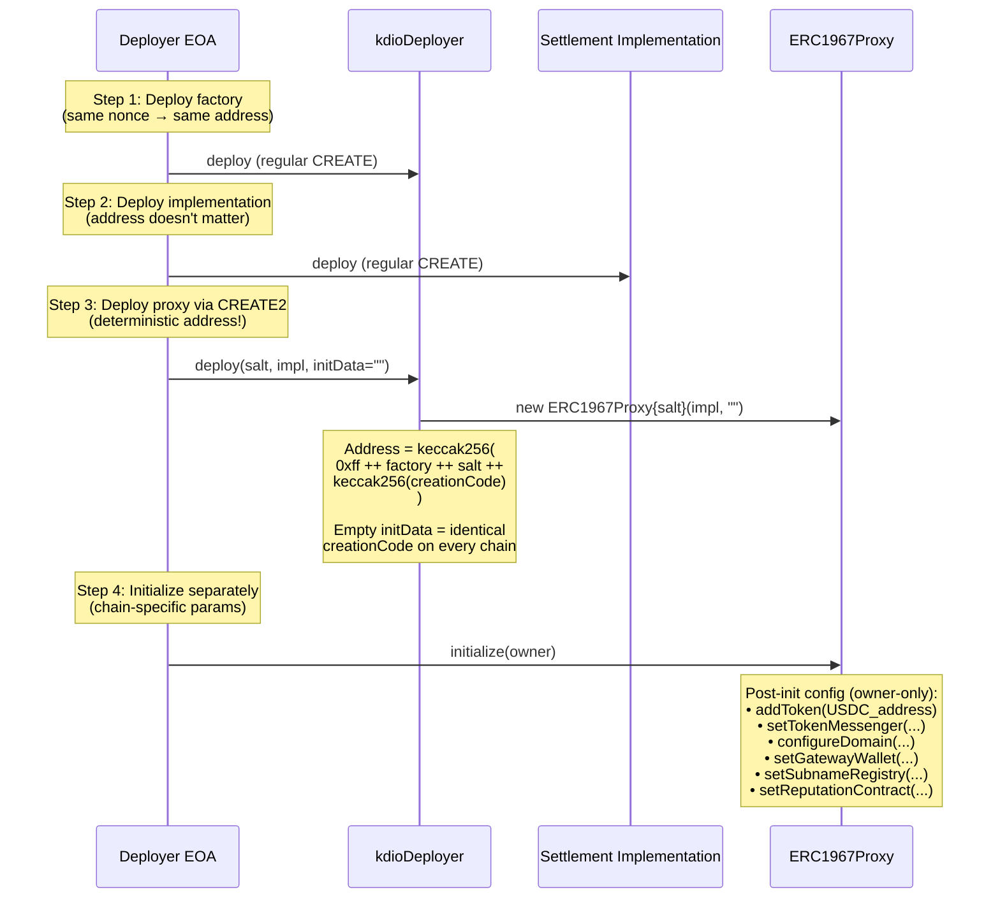
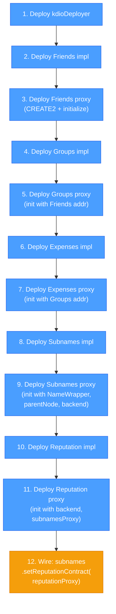
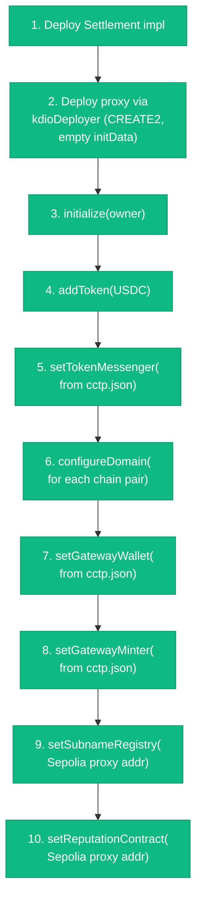
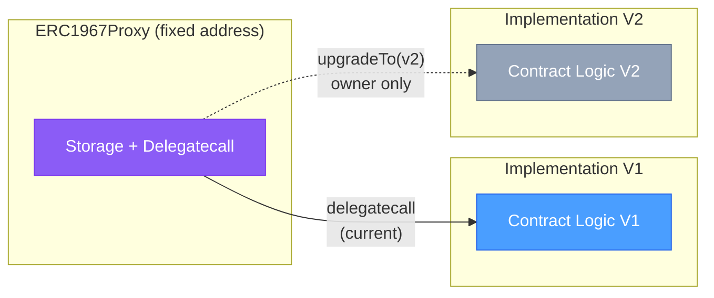

# khaaliSplit — Deployment & Cross-Chain Architecture

> How contracts are deployed deterministically and how the system spans multiple chains.

## Cross-Chain Topology

---

## CREATE2 Deterministic Deployment

The `kdioDeployer` factory ensures the same proxy address across all chains for the Settlement contract.

---

## Deployment Order

Two deployment scripts handle the full system:

### `DeployCore.s.sol` — Home Chain (Sepolia)

### `DeploySettlement.s.sol` — Each Chain

---

## UUPS Upgrade Pattern

All contracts (except kdioDeployer) follow the same upgrade pattern:

**Key properties:**
- Proxy address never changes (users and other contracts always call the same address)
- Storage lives in the proxy, logic lives in the implementation
- Only the contract owner can trigger upgrades (`_authorizeUpgrade` + `onlyOwner`)
- Constructor calls `_disableInitializers()` to prevent direct implementation initialization
