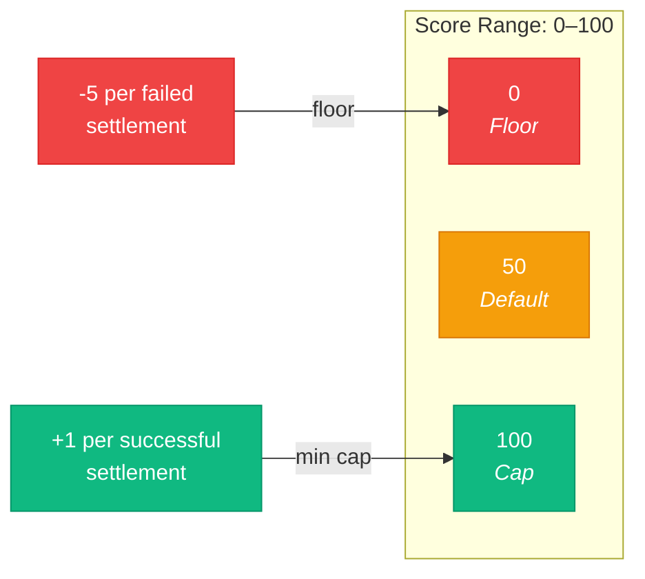
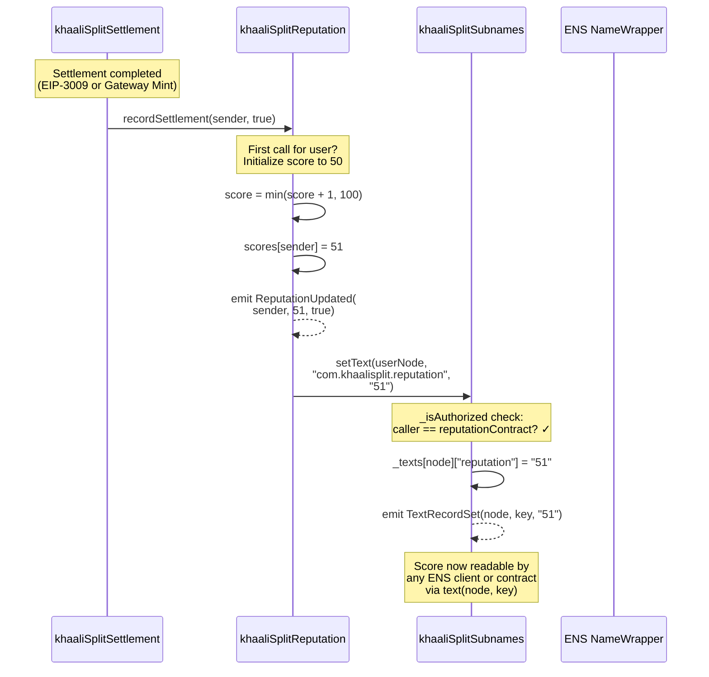
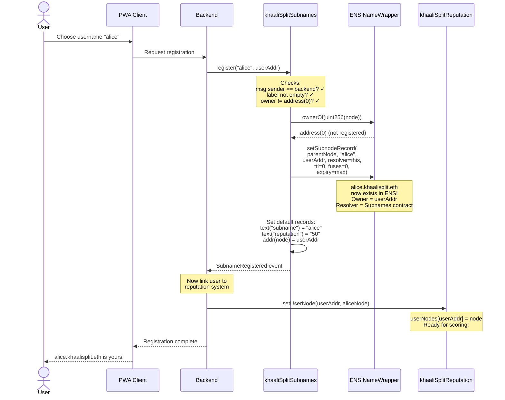
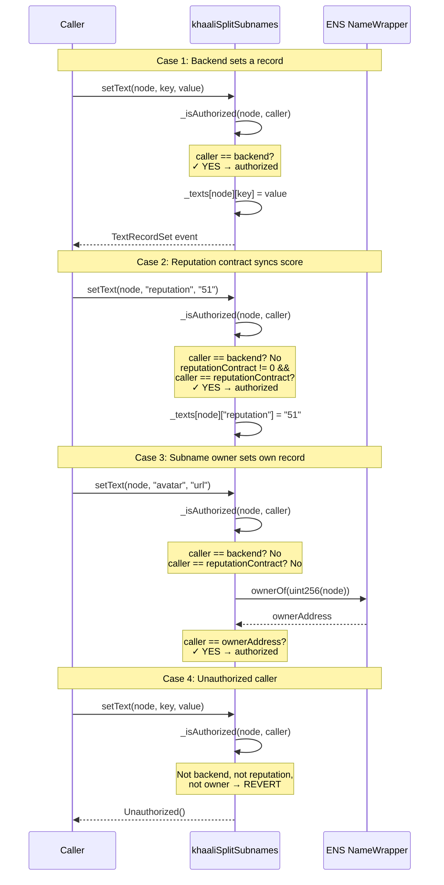
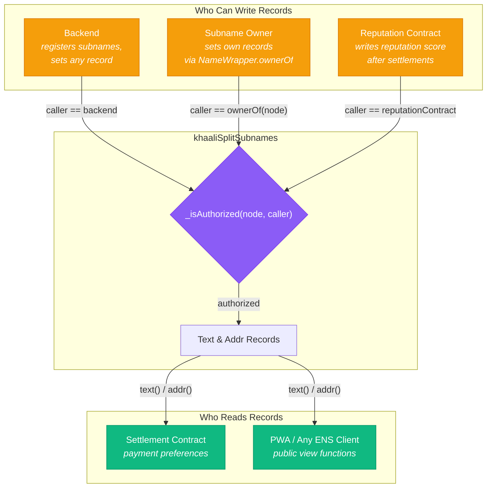
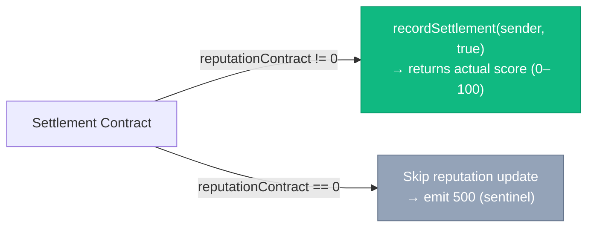
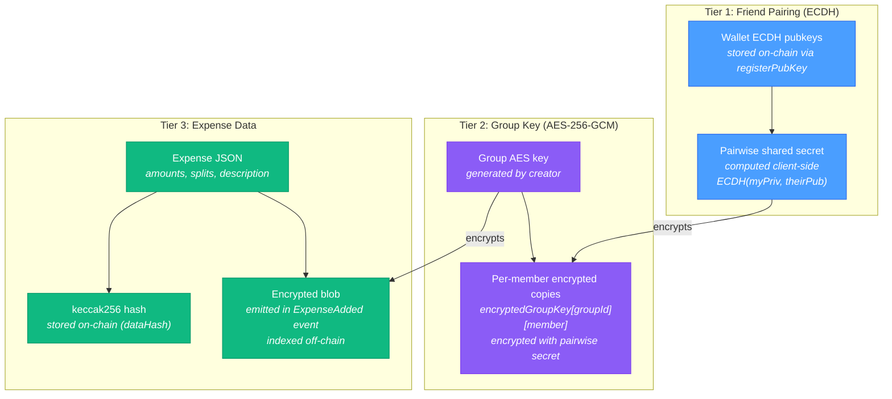
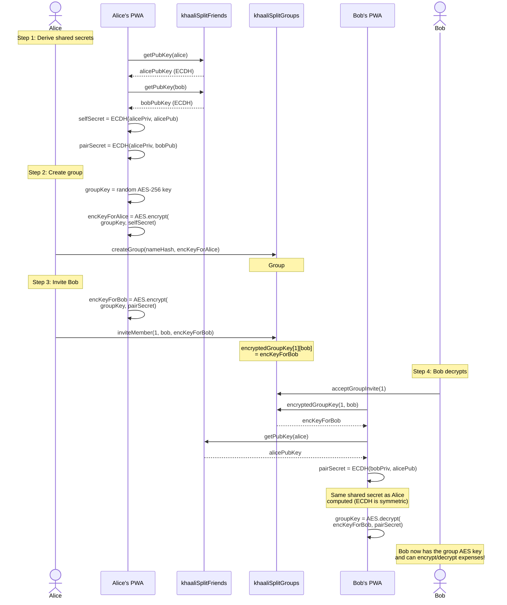

# khaaliSplit — Reputation & ENS Identity System

> How on-chain reputation scoring works and how it integrates with ENS subnames as the identity backbone.

## ENS as Identity Backbone

Every khaaliSplit user gets an ENS subname (`{user}.khaalisplit.eth`) that serves as their on-chain identity. The subname node (`bytes32`) is the canonical identifier used across the entire system.

```mermaid
graph TB
    subgraph ens["ENS Identity: alice.khaalisplit.eth"]
        NODE["bytes32 node<br/><i>namehash('alice.khaalisplit.eth')</i>"]

        subgraph records["On-Chain Records (khaaliSplitSubnames)"]
            ADDR["addr(node) → 0xAlice..."]
            T1["text('com.khaalisplit.subname') → 'alice'"]
            T2["text('com.khaalisplit.reputation') → '51'"]
            T3["text('com.khaalisplit.payment.flow') → 'gateway'"]
            T4["text('com.khaalisplit.payment.token') → '0x833...'"]
            T5["text('com.khaalisplit.payment.chain') → '8453'"]
            T6["text('com.khaalisplit.payment.cctp') → '6'"]
        end
    end

    subgraph consumers["Who Reads These Records"]
        SET["Settlement Contract<br/><i>reads addr, payment.*</i>"]
        REP["Reputation Contract<br/><i>writes reputation score</i>"]
        CLIENT["PWA Client<br/><i>reads all records</i>"]
    end

    NODE --> records
    SET -->|reads| ADDR
    SET -->|reads| T3
    SET -->|reads| T4
    REP -->|writes| T2
    CLIENT -->|reads| records

    classDef node fill:#8b5cf6,stroke:#7c3aed,color:#fff
    classDef record fill:#e0f2fe,stroke:#0284c7,color:#0c4a6e
    classDef consumer fill:#4a9eff,stroke:#2563eb,color:#fff

    class NODE node
    class ADDR,T1,T2,T3,T4,T5,T6 record
    class SET,REP,CLIENT consumer
```

---

## Reputation Score Mechanics

| Scenario | Delta | Example |
|----------|-------|---------|
| Successful settlement | +1 | 50 → 51 → 52 → ... → 100 (cap) |
| Failed settlement | -5 | 50 → 45 → 40 → ... → 0 (floor) |
| New user (no settlements) | — | Returns default 50 |
| Score exactly at 5 | -5 | 5 → 0 (exact boundary) |
| Score below 5 (e.g. 3) | -5 | 3 → 0 (underflow protection) |

---

## Reputation Update & ENS Sync Flow

After every settlement, the reputation score is updated and automatically synced to the user's ENS text record.

---

## Subname Registration Sequence

How a new ENS subname is registered and wired into the system:

---

## Record Update Authorization Sequence

How the `_isAuthorized` check works when different callers try to set records:

---

## Authorization Model

Three contracts share a trust relationship for reading and writing ENS records:

---

## Reputation Sentinel Value

When the reputation contract is not configured on the settlement contract (`address(0)`), the `SettlementCompleted` event emits a sentinel value of **500** for `senderReputation`. This is distinguishable from valid scores (0–100) and lets indexers/clients know that reputation was not tracked for this settlement.

---

## Encryption Model

The contract system supports three tiers of client-side encryption. Contracts never see plaintext data.

### Encryption Key Exchange Sequence

How encrypted group keys are distributed when creating a group and inviting members:

